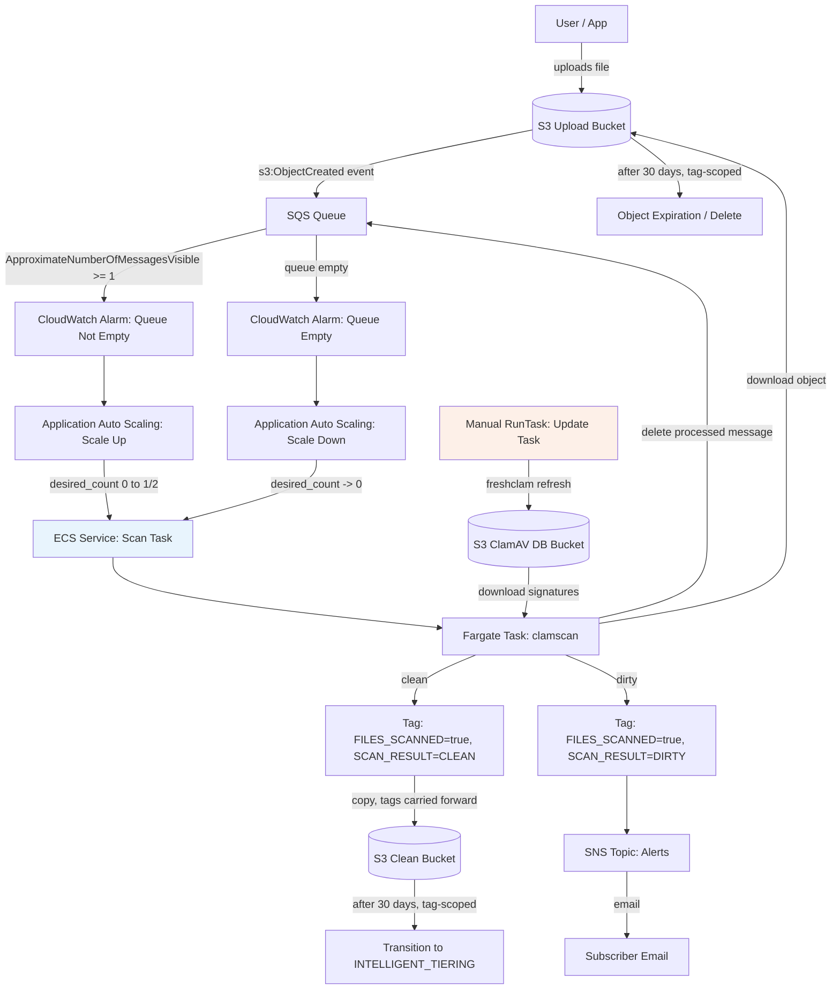

# ClamAV S3 Scanning Automation

Serverless, event-driven malware scanning pipeline for files uploaded to S3. Built as a learning project (Terraform + AWS ECS/Fargate + Python), migrating a manually-built AWS setup into fully codified infrastructure.

## Architecture



**Key architectural notes:**
- The scan task is **one-shot**: it grabs a message, processes it, and exits. It is not a long-running poller.
- The ECS Service for the scan task runs at `desired_count = 0` by default and is scaled up/down entirely by CloudWatch alarms watching SQS queue depth — not by a continuously-running process.
- The **update task** (ClamAV signature refresh) has no Service, no autoscaling, and no automated trigger. It runs only via a manual `aws ecs run-task` call. This was a deliberate scope decision, not an oversight.

## Components

### Networking (`network` module)
- VPC with public + private subnets across the account's available AZs
- Single NAT Gateway (public subnet) so private-subnet tasks get outbound internet access (S3, SQS, SNS, ClamAV mirrors) without being publicly reachable
- Security group for the scan task: egress-all, no ingress (task only makes outbound calls)

### Storage & messaging (`s3-sqs` module)
- **3 S3 buckets**: upload, clean, and ClamAV signature DB
- **SQS queue**: receives `s3:ObjectCreated` notifications from the upload bucket, scoped via an `aws:SourceArn` condition so only that bucket can publish to it
- **SNS topic**: email subscription, notified whenever a dirty file is detected
- **Lifecycle rules**, both scoped to objects tagged `FILES_SCANNED=true` (i.e., only fully-processed files are affected):
  - Upload bucket: objects **expire (delete) after 30 days**
  - Clean bucket: objects **transition to `INTELLIGENT_TIERING` after 30 days**

### Compute (`ecs` module)
- ECS cluster (Fargate)
- Two task definitions: `scan` and `update`, each with its own IAM task role (least-privilege boundary between the two responsibilities)
- CloudWatch log groups per task, 7-day retention

### Autoscaling (`autoscaling` module)
- Two CloudWatch alarms on `ApproximateNumberOfMessagesVisible`: one triggers scale-up when messages arrive, one triggers scale-down when the queue is empty
- Application Auto Scaling step policies drive the scan Service's `desired_count` between 0 and 2

## Application flow (`src/`)

1. **`main.py`** — CLI entrypoint (`--action scan` or `--action update`), matches the container's `CMD`
2. **`update_db.py`** (`update_db_in_s3`) — runs `freshclam` to pull the latest signatures, uploads any `.cvd` files found to the DB bucket. Per-file try/except; returns the list of any files that failed to upload.
3. **`download_db.py`** (`download_db_from_s3`) — downloads the DB bucket's signature files locally before scanning. Per-file try/except; if *all* files fail, the scan run raises and aborts (scanning against nothing is pointless); if *some* fail, it logs a warning and proceeds best-effort.
4. **`helper.py`** (`process_sqs_message`) — the core scan flow:
   - Receives up to 10 messages from SQS
   - For each message → each S3 event record: downloads the object, runs `clamscan`, tags the object (`FILES_SCANNED`, `SCAN_RESULT`)
   - **Clean files**: copied to the clean bucket (tags carried forward automatically via S3's default `TaggingDirective=COPY`, since tagging happens before the copy)
   - **Dirty files**: SNS alert published
   - SQS message deleted once its branch completes
   - Folder-placeholder objects (keys ending in `/`) are skipped

## Environment variables

All environment-dependent values are read via `os.getenv(...)` with local (Mac) defaults, so the same code runs unmodified in the container:

| Variable | Purpose |
|---|---|
| `DATABASE_DIRECTORY` | Local path for ClamAV signature files |
| `CLAMAV_DB_BUCKET_NAME` | S3 bucket holding the ClamAV DB |
| `CLAMAV_DB_BUCKET_PATH` | Prefix within the DB bucket |
| `CLEAN_BUCKET_NAME` | Destination bucket for clean files |
| `SNS_TOPIC_ARN` | Topic for dirty-file alerts |
| `QUEUE_URL` | SQS queue URL |

## Repository structure

```
.
├── Dockerfile
├── src/
│   ├── main.py
│   ├── helper.py
│   ├── download_db.py
│   └── update_db.py
├── provider.tf
├── main.tf
├── variables.tf
├── locals.tf
├── outputs.tf
├── network/
├── ecs/
├── autoscaling/
└── s3-sqs/
```

## Deployment

**Container image:**
```bash
docker build --platform linux/amd64 -t clamav-scanner .
docker run --rm clamav-scanner python3 main.py --action scan
```

**Infrastructure:**
```bash
terraform init
terraform validate
terraform plan
terraform apply
```

Terraform state is stored remotely in S3 (`provider.tf` backend block) with native S3 locking (`use_lockfile`).

Required variables (via `.tfvars` or `TF_VAR_*`): `aws_profile`, `aws_region`, `project_name`, `vpc_cidr`, `pvt_sub_cidr`, `pub_sub_cidr`, `cont_def` (container definitions incl. image URIs), `alert_email`.

**Running the update (DB refresh) task manually:**
```bash
aws ecs run-task \
  --cluster <cluster-name> \
  --task-definition <project_name>-update-tasf-def \
  --launch-type FARGATE \
  --network-configuration "awsvpcConfiguration={subnets=[<private-subnet-id>],securityGroups=[<sg-id>],assignPublicIp=DISABLED}"
```

## Security

- **Network isolation**: the scan task runs in a private subnet with no ingress rules at all — it only makes outbound calls (S3, SQS, SNS, ClamAV mirrors via NAT). Nothing can reach it directly.
- **Scoped resource policies**: the SQS queue policy only allows `SQS:SendMessage` from the upload bucket specifically, enforced via an `aws:SourceArn` condition — not open to any S3 bucket in the account.
- **Separate IAM roles per task**: `scan` and `update` each get their own task role, so a compromised scan task doesn't inherit permissions it doesn't need for the update path (and vice versa). Both are also separate from the shared `ecs_task_exec_role`, which only handles pulling the image and writing logs.
- **No secrets or account-specific values in source control**: every environment-dependent value (bucket names, queue URL, topic ARN, DB paths) is read via `os.getenv(...)` with local-only defaults, and injected via the ECS task definition's environment block at deploy time — not hardcoded in the Python files. The committed `terraform.tfvars.example` uses placeholders; the real `terraform.tfvars` (with your account ID and email) stays out of version control.
- **Remote state protection**: Terraform state lives in a private S3 backend with encryption and native locking enabled (`encrypt = true`, `use_lockfile = true`), so state isn't sitting in plaintext locally or subject to concurrent-write corruption.
- **Known, accepted tradeoff — not full least privilege**: the `scan_policy` and `update_policy` IAM policies use `s3:*`, `sqs:*`, `sns:*` action wildcards with `Resource: "*"`, rather than being scoped to the specific buckets/queue/topic ARNs this project actually uses. This was a deliberate scope decision (see project handoff) rather than an oversight — tightening this to per-resource, per-action permissions would be the natural next step for a production-grade version of this project.

## Tagging scheme

| Tag | Values | Applied to |
|---|---|---|
| `FILES_SCANNED` | `true` | Every processed object (upload bucket, carried to clean bucket copy) |
| `SCAN_RESULT` | `CLEAN` / `DIRTY` | Every processed object |

These tags drive both the routing logic (SNS alert vs. copy-to-clean) and the S3 lifecycle rules (expiration / tiering), so only fully-scanned objects are affected by either.